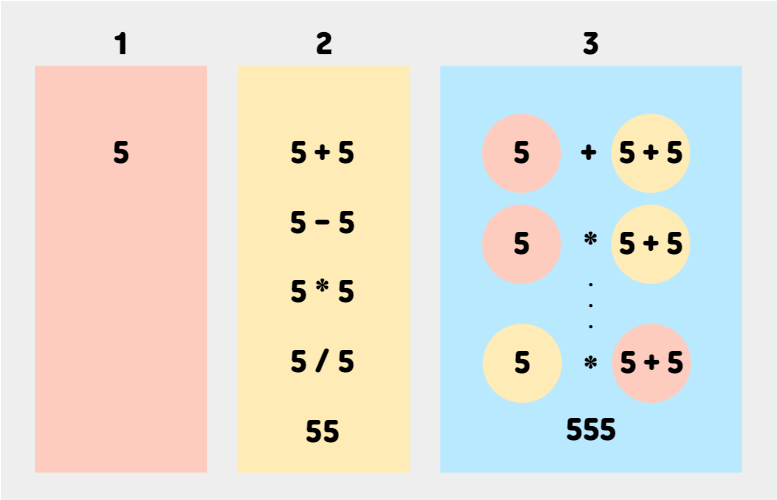

# N으로 표현

### [문제링크](https://school.programmers.co.kr/learn/courses/30/lessons/42895)

### 문제풀이

이 문제는 N을 최소한으로 사용하여 특정 숫자를 만드는 문제이다.
n을 한번 사용하였을 때, 두번 사용하였을 때 특정 숫자를 만들 수 있는지 확인하면 된다.
n은 최대 8번 사용할 수 있으므로 1~8가지 박스를 만들면 된다.

n을 5라고 가정하고 예시를 설명해 보겠다.
첫 번째 박스에는 5를 한번 사용하였을 때의 수를 넣어주면 되므로 5하나를 넣는다.

두 번째 경우에는 5를 두 번 사용하여 만들 수 있는 모든 수를 넣어주면 된다.
사칙연산 밖에 쓰지 못하므로 '5+5, 5-5, 5*5, 5/5, 55' 가 있다.
이러한 결과를 얻기 위해서는 두 번째 박스를 채울 때 1번 박스와 1번 박스의 사칙연산의 결과를 2번 박스에 담으면 된다.

세 번째 박스를 채울때는 1번 박스와 2번 박스의 연산으로 만들면 될 것이다.

네 번째 박스는 1번과 3번 2번과 2번 연산으로 만들면 된다.
즉 서로 다른 박스 번호의 합이 구하고자 하는 박스의 번호이면 된다.

주의해야 할 점은 네 번째 박스의 값을 구할 때 1번과 3번, 3번과 1번의 연산 둘다 해줘야 한다.
10/5와 5/10의 결과가 다르듯이 연산의 순서가 다를 때의 값도 구해줘야 한다.

### 알고리즘 풀이
1. N번 사용하여 만든 숫자를 담을 박스 1~8을 만든다.
2. 1번 박스는 N숫자 1개만 담을 수 있으므로 N을 넣는다.
3. 2이상의 N번 박스는 N번 미만의 박스 번호의 합이 N이 되는 박스끼리의 연산의 합을 더해 구한다.
   (ex. 5인 경우 1+4, 2+3, 3+2, 4+1, 2+2)
4. 각 박스마다 연속된 숫자를 넣어준다.



N이 5인 경우의 1~3번 박스 이미지

```java
public class N으로_표현 {
    //a번과 b번 박스의 연산 구하기
    void unionSet(Set<Integer> union, Set<Integer> a, Set<Integer> b) {

        for (Integer num1 : a) {
            for (Integer num2 : b) {
                union.add(num1 + num2);
                union.add(num1 * num2);
                union.add(num1 - num2);
                if ( num2 != 0) {
                    union.add(num1/num2);
                }
            }
        }
    }
    public int solution(int N, int number) {
        List<Set<Integer>> setList = new ArrayList<>();
        for (int i = 0; i < 9; i++) {
            setList.add(new HashSet<Integer>());
        }
        if (number == N)
            return 1;
        setList.get(1).add(N); //1번 박스에 값 넣기
        //2번 박스 이상의 박스 값 구하기
        for (int i = 2; i < 9; i++) {
            for (int j = 1; j <= i / 2; j++) {
                unionSet(setList.get(i), setList.get(j), setList.get(i-j)); 
                unionSet(setList.get(i), setList.get(i-j), setList.get(j));
            }
            String stringN = Integer.toString(N);
            setList.get(i).add(Integer.valueOf(stringN.repeat(i)));//연속된 숫자 넣기
            for (Integer num : setList.get(i)) {
                if (num == number) {
                    return i; //최소한의 N번 사용 값
                }
            }
        }
        return -1; //9번 이상의 숫자 N숫자 사용
    }
}
```