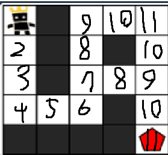

# 게임 맵 최단 거리

### [문제 링크](https://school.programmers.co.kr/learn/courses/30/lessons/1844)

### 문제 풀이
이 문제는 목적지에 도착하는 여러 경로중에서 최단 경로를 찾는 문제이다.
최단 경로를 찾는 대표적인 알고리즘은 bfs이다. bfs원리를 이용하여 최단거리에 이르는 찾으면 된다.
아래 이미지는 bfs를 활용하여 최단 거리를 찾을 때 찾는 과정을 보여주고 있다. 이미지의 각 길의 숫자는 깊이를 나타낸다. 
시작지점의 깊이를 1이라 가정하고 같은 깊이의 길부터 차례로 이동하며 각 길에 깊이를 표기하여 최적의 길을 찾는다.



bfs 최단 거리 찾기
### 알고리즘 풀이
1. 인접한 길의 위치를 담을 queue를 만들고 큐에 시작위치 [0,0]의 값을 넣는다.
2. width와 move 변수를 정의한다.
   + width 변수는 현재 위치의 깊이에서 방문하지 않은 길의 개수를 나타낸다. 즉 width가 0이라면 현재 위치한 깊이의 길은 모두 방문한 것이라 보면 된다.
   + move 변수는 깊이를 나타낸다. width가 0일 때 마다 깊이는 1증가하므로 move를 1 더해준다.
3. queue에 담겨진 첫번째 길을 꺼내며 width의 값을 1 줄인다. (새로운 길을 방문하였기 때문)
4. 꺼낸 길의 인접한 길이 갈수 있는 길이라면 큐에 길의 위치를 담는다.
5. 담아진 길의 위치는 방문될 길이므로 변수에 0을 넣어 갈 수 없는 길로 표시한다.
6. width가 0 인지 확인한다. 만약 width가 0이라면 현재 위치한 깊이의 모든 길을 찾은 것 이므로 다음 깊이의 길 개수를 넣는다.
7. 만약 width가 0이며 목적지가 방문된 상태이면 최단 경로를 찾은 상태이므로 answer값에 move를 넣는다.
8. 만약 목적지의 값이 1인 상태라면 길이 막혀있는 상태이므로 anmswer=-1이 된다.
### 코드

```java
public class 게임_맵_최단거리 {
    public int solution(int[][] maps) {
        int answer = 0;
        Queue<Integer[]> queue = new LinkedList<>();
        int col = maps[0].length;//열
        int row = maps.length;//행
        int move = 0;
        int width = 1;
        queue.add(new Integer[] {0, 0});
        maps[0][0] = 0;
        while(!queue.isEmpty()) {
            Integer[] poll = queue.poll();
            width--;
            //poll, 0은 행, 1은 열
            Integer x = poll[0];
            Integer y = poll[1];

            System.out.println(x+ ":" + y);
            //아래
            if ( x + 1 < row && maps[x + 1][y] == 1 ) {
                //아래 한칸
                queue.add(new Integer[] {x+1, y});
                maps[x+1][y] = 0;
            }
            //오른쪽
            if ( y + 1 < col && maps[x][y+1] == 1 ) {
                //오른쪽 한칸
                queue.add(new Integer[] {x, y+1});
                maps[x][y+1] = 0;
            }
            //위
            if ( x > 0 && maps[x - 1][y] == 1 ) {
                //위쪽 한칸
                queue.add(new Integer[] {x-1, y});
                maps[x-1][y] = 0;
            }
            //왼쪽
            if ( y > 0 && maps[x][y-1] == 1 ) {
                //왼쪽 한칸
                queue.add(new Integer[] {x, y-1});
                maps[x][y-1] = 0;
            }

            if ( width == 0 ) {
                width = queue.size();
                move++;
                if ( maps[row -1][col- 1] == 0 ) {
                    move++;
                    break;
                }
            }
        }
        answer = move;
        if ( maps[row-1][col-1] == 1 ) {
            answer = -1;
        }
        return answer;
    }
}


```