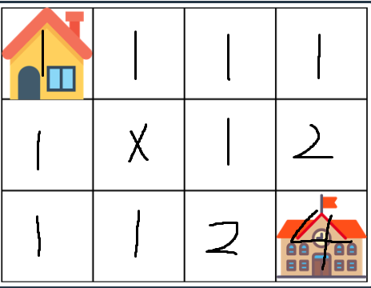

# 등굣길 풀이

### [문제링크](https://school.programmers.co.kr/learn/courses/30/lessons/42898)

### 문제풀이
이 문제는 집에서 학교까지 최단경로 개수를 구하는 문제이다.
아래 이미지와 같이 집을 시작지점으로 하여 각 칸에 최단 경로로 갈 수 있는 경로 수를 기록한다.
집은 시작지점으로 한 가지 경수이다. 사격형 칸들은 왼쪽 칸과 위쪽 칸 두 가지 경우의 최적의 경로가 존재하므로 왼쪽 칸의 최적 경로 수와 위쪽 칸의 최적 경로수를 더해 현재 칸의 최적 경로의 수를 구한다.
예를 들면 아래 그림의 2행 4열 칸의 왼쪽 최적 경로 1, 위쪽 최적 경로 1을 더하여 2가지의 최적 경로의 수를 가진 것을 볼 수 있다.
사각형의 위쪽 변과 왼쪽 변 부분은 최단 경로 수를 구할 칸이 위쪽 또는 왼쪽이 없으므로 최적 경로의 수가 1이 된다.
물에 잠긴 지역은 갈 수 없으므로 최적 경로 수를 0으로 채워서 계산한다.




집에서 학교까지 최단경로 개수 구하는 이미지
### 알고리즘 풀이
1. m(열), n(행) 을 이용하여 배열 int[n][m]을 만든다.
2. 시작지점 배열 [0][0] 부분에 최적 경로의 수 1을 넣는다.
3. 물게 잠긴 지역의 위치를 배열에 표시하기 위해 -1을 넣는다.
4. 각 칸의 최적 경로의 수를 구하기 위해 현재 칸의 왼쪽 칸과 위쪽 칸의 최적 경로의 수를 더해 현재 칸의 최적 경로의 수를 구한다.
5. 배열의 마지막 인덱스가 학교의 위치이므로 answer 변수에 배열의 마지막 값을 넣는다.
### 소스코드
```java
public class 등굣길 {
    public int solution(int m, int n, int[][] puddles) {
        int answer = 0;
        int[][] location = new int[n][m];
        location[0][0] = 1;
        for (int[] puddle : puddles) {
            location[puddle[1] - 1][puddle[0] - 1] = -1;
        }
        for (int i = 0; i < n; i++) {
            for (int j = 0; j < m; j++) {
                int a = 0; //왼쪽 값
                int b = 0; //위쪽 값
                if ( i != 0 || j != 0) {
                    if ( i != 0 ) {
                        b = location[i-1][j];
                    }
                    if ( j != 0) {
                        a = location[i][j-1];
                    }
                    location[i][j] = location[i][j] != -1 ? (a + b) % 1000000007 : 0;
                }
            }
        }
        answer = location[n-1][m-1];
        return answer;
    }
}

```